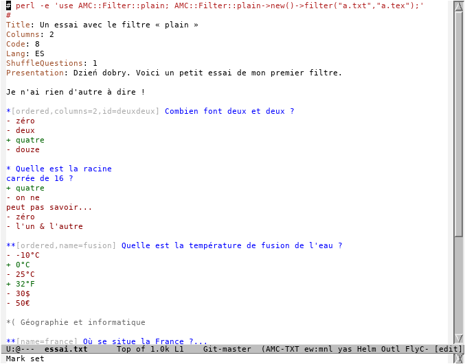
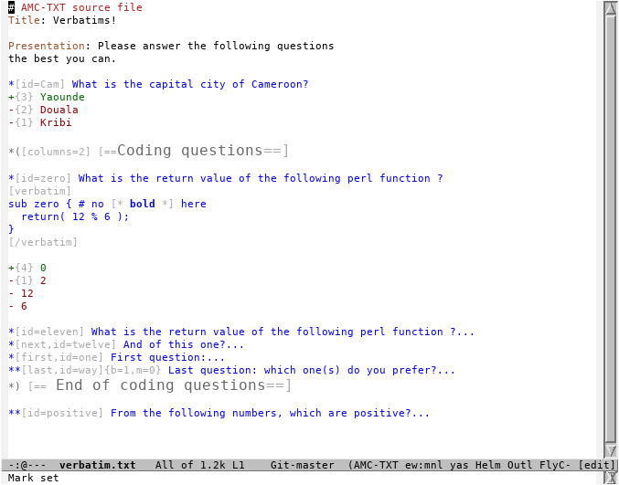

# Emacs major mode for AMC-TXT files

[Auto Multiple Choice](https://project.auto-multiple-choice.net/projects/auto-multiple-choice)
is an open source software for creating and managing multiple choice
questionnaires. The questionnaires can be created in LaTeX or in
simpler
[AMC-TXT](https://www.auto-multiple-choice.net/auto-multiple-choice.en/AMC-TXT.shtml)
syntax. This mode makes it easier to edit the AMC-TXT files in Emacs.

## Features

- Syntax highlighting
- Navigation commands for questions and groups: <kbd>M-n</kbd>,
  <kbd>M-p</kbd>, <kbd>M-N</kbd>, <kbd>M-P</kbd>
- Folding of questions and groups via `outline-mode`
- Paragraph filling of single question/answer
- Hiding of question options

## Usage

Put `(require 'amc-txt)` in your Emacs init file and put either `#
AMC-TXT` or `# -*- amc-txt -*-` at the first line your AMC-TXT files.
If you open an AMC-TXT file without the first special line, you can
activate this mode by `M-x amc-txt-mode`.

## Screenshots

The following screenshot shows basic syntax highlighting:

The screenshot below shows highlighting of verbatim and bold markups
as well as folding of some questions (indicated with `...`):

## Author and License

- Author: Michal Sojka
- License: GPLv3

<!-- Local Variables: -->
<!-- mode: markdown -->
<!-- End: -->
